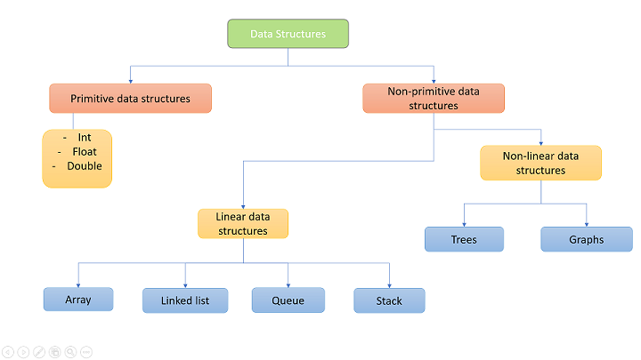
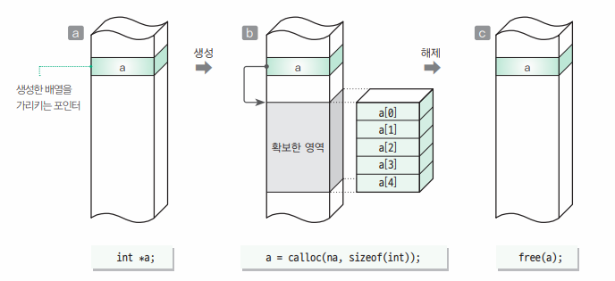

# iot-algorithm-2026
IoT 개발자 과정 자료구조/알고리즘 리포지토리

## 개요

### 자료구조

- 정의
    - 데이터를 구성하는 구조. 데이터를 원하는 요구에 따라 처리할 때 호율적으로 처리하기 위해서
    - 자료(Data) + 구조(structure) -> DataStructure
    - 자료형(DataType) : int,double,char...
    - 자료구조(DS) : 배열,포인터,구조체...
    - 주소록 -> 구조체로 구성된 배열(크기 고정), 구조체 포인터(동적 조정가능)

- 종류
    - 단순형 : 정수,실수,문자,문자열...
    - 선형 : 배열,`리스트`,`스택`,`큐`
    - 비선형 : `트리`,`힙`,`그래프`
    - 파일 : 순차파일,색인파일,직접파일...

#### 알고리즘

- 정의
    - 프로그램 : 데이터를 처리하는 소프트웨어
    - 데이터를 처리할 때 문제를 해결하는 논리적인 방법과 순서

- 필요요건
    - 입력 : 알고리즘 외부에서 제공되는 자료가 필요
    - 출력 : 최소 1개 이상의 결과 도출 필요
    - 명확 : 각 단계가 애매함이 없어야함
    - 유한성 : 유한한 횟수를 거친 후 문제 해결,종료
    - 효과성 : 유한한 시간안에 수행할 수 있을 정도로 단순

- 복잡도 - 시간과 메모리를 얼마나 소모하는지 효율성을 따지는 척도
    - `시간 복잡도` : 자료의 수 n이 증가할 때 시간이 얼마만큼 증가하는지 판단
    - 공간 복잡도 : 자료의 수 n이 증가할 때 컴퓨터 메모리를 얼마만큼 사용하는지 판단, 임베디드/펌웨어에서는 중요
    
- 종류 - 자료구조를 가지고 해결하는 방법
    - `정렬` : 삽입,선택,버블,쉽,퀵,병합,힙...
    - `재귀` 알고리즘
    - `검색` : 특정 데이터 찾기,선형 검색, 이진 검색
    - `탐색` : 모든 데이터 방문 ,DFS(깊이 우선 탐색),BFS(너비 우선 탐색), 이진 탐색
    - 문자열 `검색` : 부루트-포스,KMP,보이어-무어...
    - `그래프` : 다익스트라(최단거리), 벨먼-포드, A*
    - 그리디 알고리즘,백트래킹,분할 정복
    - 동적계획법 : 메모이제이션
    - 인공지능 : 신경망,SVM(서포트 벡터 머신),회귀 분석,....
    - 운영체제 : 세마포어,뮤텍스,데드락,멀티테스킹,멀티스레드
    - 네트워크 : QoS,라우팅,...
    - 암호화 : AES,DES,SEED,MD5,RSA...

- 참조 웹사이트
    - https://blog.amigoscode.com/p/11-data-structures-every-developer

### 자료구조/알고리즘 예제

1. 알고리즘 핵심
    - 순서도와 연결 : [확인](./basic/algorithm01/app02/app02.c)
2. 메모리 구조
    - 코드 영역 - 소스코드 저장되는 부분
    - 데이터영역 - 전역,정적 변수 할당, 프로그램 시작 시 할당되고, 종료 시 메모리 해제
    - 스택 영역 - 함수 호출 시 생성되는 지역변수,매개변수 할당,저장. 호출 완료 시 메모리 해제
    - `힙 영역` - 동적으로 메모리 할당, malloc,calloc,realloc 과 연계
        

3. 자료구조
    - 배열 : 같은 자료형의 묶음
    - 동적할당 : [확인](./basic/algorithm01/app03/app03.c)
    - 포인터 연습 1~5 : [확인](./basic/algorithm01/pointer01/pointer01.c)~

4. 알고리즘 필요성
    - 난수 : [확인](./basic/algorithm01/app04/app04.c)
    - 소수 : [확인](./basic/algorithm01/app05/app06.c)
        - 같은 답을 얻는 알고리즘은 하나가 아님.
        - 빠른 알고리즘은 메모리를 많이 사용.

### 검색

### 스택과 큐

### 재귀 알고리즘

### 정렬 알고리즘

### 문자열 검색 알고리즘

### 리스트 자료구조

### 해서 자료구조