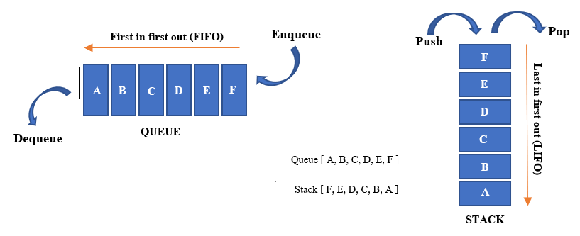
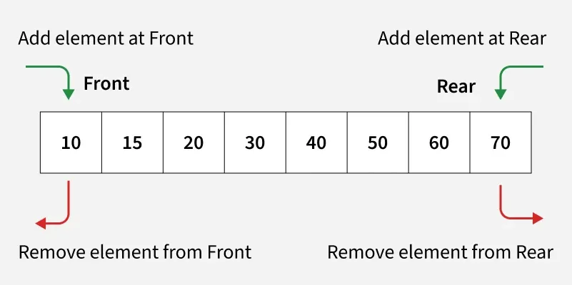
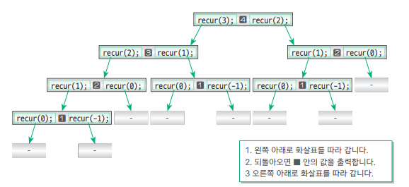
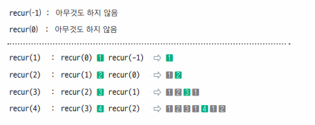
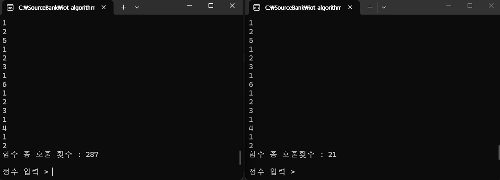
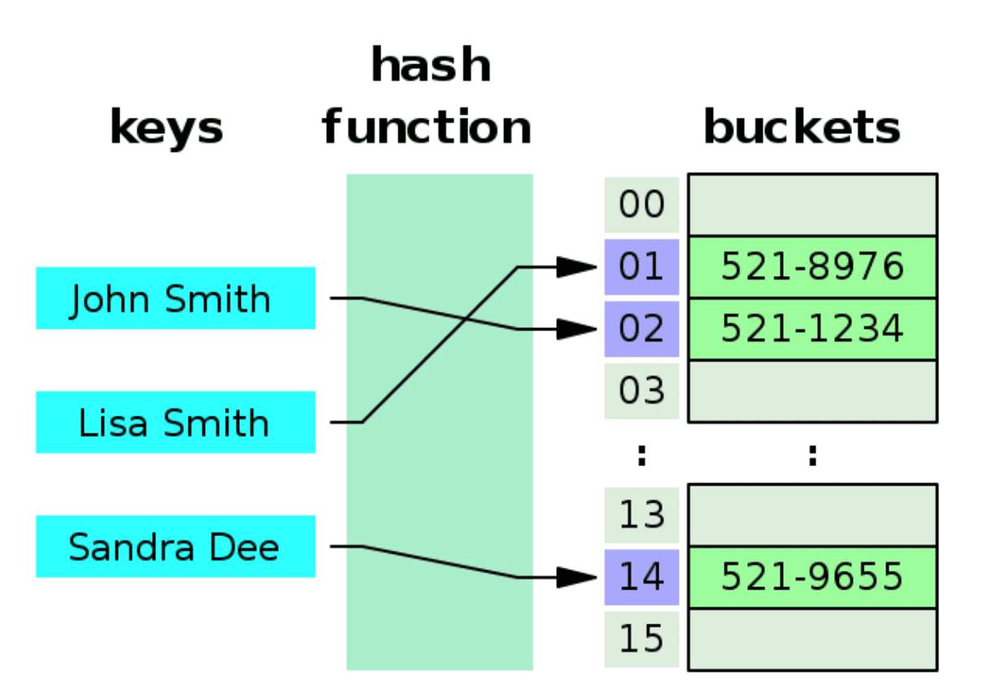

# iot-algorithm-2026
IoT 개발자 과정 자료구조/알고리즘 리포지토리

## 개요

### 자료구조

- 정의
    - 데이터를 구성하는 구조. 데이터를 원하는 요구에 따라 처리할 때 호율적으로 처리하기 위해서
    - 자료(Data) + 구조(structure) -> DataStructure
    - 자료형(DataType) : int,double,char...
    - 자료구조(DS) : 배열,포인터,구조체...
    - 주소록 -> 구조체로 구성된 배열(크기 고정), 구조체 포인터(동적 조정가능)

- 종류
    - 단순형 : 정수,실수,문자,문자열...
    - 선형 : 배열,`리스트`,`스택`,`큐`
    - 비선형 : `트리`,`힙`,`그래프`
    - 파일 : 순차파일,색인파일,직접파일...

#### 알고리즘

- 정의
    - 프로그램 : 데이터를 처리하는 소프트웨어
    - 데이터를 처리할 때 문제를 해결하는 논리적인 방법과 순서

- 필요요건
    - 입력 : 알고리즘 외부에서 제공되는 자료가 필요
    - 출력 : 최소 1개 이상의 결과 도출 필요
    - 명확 : 각 단계가 애매함이 없어야함
    - 유한성 : 유한한 횟수를 거친 후 문제 해결,종료
    - 효과성 : 유한한 시간안에 수행할 수 있을 정도로 단순

- 복잡도 - 시간과 메모리를 얼마나 소모하는지 효율성을 따지는 척도
    - `시간 복잡도` : 자료의 수 n이 증가할 때 시간이 얼마만큼 증가하는지 판단
    - 공간 복잡도 : 자료의 수 n이 증가할 때 컴퓨터 메모리를 얼마만큼 사용하는지 판단, 임베디드/펌웨어에서는 중요
    
- 종류 - 자료구조를 가지고 해결하는 방법
    - `정렬` : 삽입,선택,버블,쉽,퀵,병합,힙...
    - `재귀` 알고리즘
    - `검색` : 특정 데이터 찾기,선형 검색, 이진 검색
    - `탐색` : 모든 데이터 방문 ,DFS(깊이 우선 탐색),BFS(너비 우선 탐색), 이진 탐색
    - 문자열 `검색` : 부루트-포스,KMP,보이어-무어...
    - `그래프` : 다익스트라(최단거리), 벨먼-포드, A*
    - 그리디 알고리즘,백트래킹,분할 정복
    - 동적계획법 : 메모이제이션
    - 인공지능 : 신경망,SVM(서포트 벡터 머신),회귀 분석,....
    - 운영체제 : 세마포어,뮤텍스,데드락,멀티테스킹,멀티스레드
    - 네트워크 : QoS,라우팅,...
    - 암호화 : AES,DES,SEED,MD5,RSA...

- 참조 웹사이트
    - https://blog.amigoscode.com/p/11-data-structures-every-developer

- 현재 IT개발에서 직접 알고리즘을 개발할 일은 거의 없음
    - 특정 개발시 어떠한 자료구조와 어떤 알고리즘을 쓰는게 효과적인지를 습득하기 위해서
    - 미리 만들어진 알고리즘을 잘 활용하면 됨

### 자료구조/알고리즘 예제

1. 알고리즘 핵심
    - 순서도와 연결 : [확인](./basic/algorithm01/app02/app02.c)
2. 메모리 구조
    - 코드 영역 - 소스코드 저장되는 부분
    - 데이터영역 - 전역,정적 변수 할당, 프로그램 시작 시 할당되고, 종료 시 메모리 해제
    - 스택 영역 - 함수 호출 시 생성되는 지역변수,매개변수 할당,저장. 호출 완료 시 메모리 해제
    - `힙 영역` - 동적으로 메모리 할당, malloc,calloc,realloc 과 연계
        

3. 자료구조
    - 배열 : 같은 자료형의 묶음
    - 동적할당 : [확인](./basic/algorithm01/app03/app03.c)
    - 포인터 연습 1~5 : [확인](./basic/algorithm01/pointer01/pointer01.c)~

4. 알고리즘 필요성
    - 난수 : [확인](./basic/algorithm01/app04/app04.c)
    - 소수 : [확인](./basic/algorithm01/app05/app06.c)
        - 같은 답을 얻는 알고리즘은 하나가 아님.
        - 빠른 알고리즘은 메모리를 많이 사용.

### 검색 알고리즘
1. 검색 - Search, 데이터 집합에서 원하는 값을 가진 요소를 찾아내는 것

2. 선형 검색 : [확인](./basic/algorithm02/app01/app01.c)
    - 배열의 모든 요소를 순차적으로 검색
    - 찾는 요소가 있으면 그 위치에서 빠져나감
    - 찾는 요소가 없으면 배열의 마지막까지 비교
3. 이진 검색 : [확인](./basic/algorithm02/app02/app02.c)
    - 데이터가 키값으로 이미 정렬되어 있다는 가정하에 시작 - 단점
    - 찾는 요소가 있든 없든 검색횟수가 비약적으로 줄어듦
4. `복잡도(complexity)`
    - `시간 복잡도` : 실행에 필요한 시간을 평가
        - [간단내용참조](https://namu.wiki/w/%EC%8B%9C%EA%B0%84%20%EB%B3%B5%EC%9E%A1%EB%8F%84)
        - [복잡내용참조](https://ko.wikipedia.org/wiki/%EC%8B%9C%EA%B0%84_%EB%B3%B5%EC%9E%A1%EB%8F%84)
    - 공간 복잡도 : 기억 영역,파일 공간 등 물리적인 공간을 얼마나 필요하는지 평가
    - 복잡도 표현 함수 : Big-O(영문자 대문자 오, 빅오)
    - 선형 검색 시간 복잡도 : $O(n)$ 
    - 이진 검색 시간 복잡도 : $O(log n)$
    - 시간 복잡도 일반적 사용

        |시간복잡도|의미|비고|
        |:--|:--|:--|
        |$O(1)$|상수 시간|입력큭와 관계없이 항상 일정횟수 실행|
        |$O(log_2 n)$|로그시간|반복문 안의 로직으로 반복횟수가 1/2씩 줄어들때, $1$ ->$\frac{1}{2}$->$\frac{1}{4}$...문제 크기를 절반씩 줄이며 실행|
        |$O(n)$|선형시간|단일 반복문,입력 크기만큼 한 번 순회|
        |$O(n log n)$|선형 로그시간|n번 반복하면서 내부에서 $log n$연산 수행,분할정복 기반 정렬 등 사용|
        |$O(n^2)$|**이차시간**|이중 반복문, 이 이상은 실무에서 나오면 속도가 아주 느려짐!|
        |$O(n^3)$|삼차시간|삼중 반복문|
        |$O(n k)$|선형X다른변수|n과k가 독립변수일 때,문자열 비교 n개|
        |$O(2^n)$|지수시간|재귀! 모든 부분집합 탐색 등|
        |$O(n!)$|팩토리얼|...|
    - 예 : n이 30이면 

        |시간복잡도|연산횟수|
        |:--|--:|
        |$O(1)$|1|
        |$O(log_2 n)$|1.48 , 약5|
        |$O(n)$|30|
        |$O(n log n)$|150|
        |$O(n^2)$|900|
        |$O(n^3)$|27,000|
        |$O(n k)$|900|
        |$O(2^n)$|1,073,741,824|
        |$O(n!)$|30! = 2.6525×$10^{32}$ |

    - 공간복잡도
        - $O(1)$ - 변수 몇개
        - $O(n)$ - 1차원 배열, 재귀 깊이 n,트리 전체 저장 자료구조
        - $O(n^2)$ - 2차원 배열

5. besearch() 표준라이브러리 이진검색 함수 존재
    - 두 값 비교를 위한 함수포인터용 비교함수를 작성해야 함
    - p123 이후 참조

### 현재 과정 학습 로드맵
1. 언어
    - `C` , C++, SQL, Python, C#, (HTML,CSS,JS)

2. 기술
    - `기초 프로그래밍`,`알고리즘`,통신프로그램,데이터분석,웹개발,윈앱개발,IoT 

### 스택과 큐 자료구조

1. 스택 : [확인](./basic/algorithm02/app03/app03.c)
    - 한쪽 끝이 막혀있는 접시를 쌓는 구조와 동일한 자료구조 
    - 맨 처음에 쌓인 접시는 위의 쌓여있던 접시가 모두 제거되어야 꺼낼 수 있음
    - LIFO(Last In First Out) - 후입선출(가장 나중에 들어온 데이터가 가장 먼저 사용됨)

2. 스택 용어 : [확인](./basic/algorithm02/app03/IntStack.h)
    - push : 스택에 데이터 삽입
    - pop : 스택에서 데이터 꺼내는 작업
    - bottom : 스택의 가장 바닥
    - top - 스택의 가장 위

3. 큐 : [확인](./basic/algorithm03/app01/app01.c)
    - 양쪽이 다 열려있어서 한쪽에서 데이터를 추가, 반대에서 데이터를 꺼내는 자료구조
    - 실생활 ex) 영화관 티켓줄,버스대기줄,식당대기줄
    - 컴퓨터 ex) 프린터출력대기(Pool),파일입출력 스트림, 게임키보드 입력순서버퍼...
    - FIFO(First In First Out) - 선입선출 

4. 큐 용어  : [확인](./basic/algorithm03/app01/IntQueue.h)
    - enqueue : 큐의 끌에 데이터 삽입 작업  
    - dequeue : 큐의 앞에서 데이터 추출 작업
    - front : dequeue를 수행할 큐 맨 앞자리
    - rear : enqueue를 수행할 큐 맨 뒷자리

5. 큐를 배열로 구현시 단점
    - dequeue를 실행하면 배열 맨 앞자리가 빔
    - 빈 자리를 뒤의 데이터로 채우는 부가작업 필요 : O(n)
    - 보통 큐는 배열보다 연결리스트로 구현 또는 원형큐로 구현

6. 원형큐 : [확인](./basic/algorithm03/app01/IntQueue.c)
    - 일반큐 단점(빈자리 없애기 추가 로직)을 없앤 큐
    - (front+i)%max에 대해서 제대로 이해할 것

7. Deque(데크)
    
    - 스택과 큐를 합친 자료구조
    - 앞에서 인큐,디큐 뒤에서 인큐,디큐가 모두 가능한 구조

### 재귀 알고리즘
1. 의미
    - 사전적 : 본디의 곳으로 다시 돌아오는 것
    - 함수나 (알고리즘의) 자기 자신의 함수를 호출하여 더 작은 하위 문제를 해결하는 프로그램 기법 

2. 팩토리얼
    - 재귀 호출 : [확인](./basic/algorithm03/app02/app02.c)
    - 비재귀 호출 : [확인](./basic/algorithm03/app03/app03.c)

3. 재귀 분석 : [확인](./basic/algorithm03/app04/app04.c)
    - 하향식 분석 - 트리형태로 분석
    

    - 상향식 분석 - 표/점화식 전개 분석
    

4. 재귀 알고리즘 비재귀적으로 변경 : [확인](./basic/algorithm03/app05/app05.c)
    - 스택 자료구조 사용 : [확인](./basic/algorithm03/app06/app06.c)
    - 재귀호출이 처리속도를 느리게 만드는 경우가 많음
    - 비재귀적으로 변경하면 속도향상에 도움
    - 

5. `메모이제이션(Memoization)!!!` : [확인](./basic/algorithm04/app01/app01.c)
    - 특정 조건(재귀,동일한 부분문제 반복,입력크기 규모)에서 매우 강력한 성능 향상 기법
    - 이미 계산한 결과를 저장해두고 다시 호출하면 재계산하지 않고 바로 반환
    - 동적계획법에 많이 사용
    - 단점 - 메모리를 매우 많이 사용. 프로그램이 비정상 종료 될 수도 있음.
    - 시간복잡도(처리시간)를 줄이고 공간복작도(공간복작도)를 늘리는 방식
    - 일반 재귀호출 횟수와 메모이제이션 재귀호출 횟수 비교
    

### 정렬 알고리즘
1. 데이터를 기준값에 따라 오름차순(작은 값부터 큰 값으로), 내림차순(큰 값부터 작은 값으로) 데이터 나열
    - 참고사이트 : [visualgo]https://visualgo.net/en/sorting

2. 버블정렬 : [확인](./basic/algorithm04/app02/app02.c)
    - 이웃한 두 요소의 대소관계로 비교하여 변환하는 정렬방식(밀어내기)
    - 가장 큰 값을 끝으로 밀어내는 알고리즘
    - 시간복잡도 : 평균 $O(n^2)$, 최악 $O(n^2)$ ,최선 $O(n)$

3. 선택정렬 
    - 가장 작은 요소부터 선택해서 알맞은 위치에 옮겨서 순서대로 정렬방식(찍어서 교체하기)
    - 가장 작은 값을 앞으로 보내는 알고리즘
    - 시간복잡도 : 모두 $O(n^2)$

4. 삽입정렬 
    - 이미 정렬된 부분에 새 원소를 끼워넣는 정렬방식(카드정리)
    - 시간복잡도 : 평균 $O(n^2)$, 최악 $O(n^2)$ , 최선 $O(n)$

5. 쉘정렬 
    - 삽입정렬을 멀리 떨어진 간격으로 먼저 수행한 뒤 점점 간격을 줄여가는 정렬방식
    - 삽입정렬을 업그레이드해서 멀리 있는 값부터 정리
    - 삽입정렬이 완전 뒤죽박죽일때 시간복작도가 좋지 않음
    - 시간복잡도 : 평균 $O(n^{1.3})$~ $O(n^{1.5})$, 최악 $O(n^2)$,최선 $O(n log n)$

6. 퀵정렬 
    - 기준값을 정하고, 작은 값은 왼쪽, 큰 값은 오른쪽으로 나눠서 재귀적으로 정렬방식 
    - 시간복잡도 : 평균 $O(n log n)$ 최악 $O(n^2)$, 최선 $O(n log n)$             

7. 병합정렬 
    - 반으로 나눠서 각각 정렬하고, 다시 합치는 정렬방식
    - 시간복잡도 : 평균 $O(n log n)$ 최악 $O(n log n)$, 최선 $O(n log n)$ 

8. 정렬 평균기준 반복횟수 (n=10,000)
    1. 퀵(130~200,000) 반복
    2. 병합(130~150,000) 
    3. 쉘(200~800,000) 
    4. 삽입(50,000,000)
    5. 선택(100,000,000)
    6. 버블 (약 100,000,000)

### 문자열 검색 알고리즘
1. 부르트- 포스 - 모든 문자가 일치하는지 전부 비교하는 방법
    - 횟수제한 등으로 막힘

2. KMP - 부르트-포스 방법에서 패턴 형태로 변경된 비교 방법

3. 보이어-무어 - 부루트-포스와 KMP 상에서 패턴으로 옮길 크기 정해서 검색 방법

### 리스트 자료구조

1. 데이터를 순서대로 나열한 자료구조 - 배열(선형 리스트)과 동일
    - 배열을 사용할 경우 중간에 데이터가 빠지거나 추가되면 전부 밀어내는 추가 처리필요

2. 연결 리스트 - 포인터로 각 `노드`가 연결된 형태
    - 배열과 달리 중간에 데이터가 빠지거나 추가되어도 배열처럼 데이터를 옮기는 처리 필요없음

3. 현재는 C#,Java,Python 등은 배열 사용 거의 안함. 리스트 사용
    - Python의 경우 리스트로 배열을 대체. `배열이 없음`

4. 트리 - 노드를 여러 방향으로 연결하는 자료구조

### 해시 자료구조

1. 검색과 데이터 추가,삭제를 효율적으로 사용할 수 있는 자료구조
    - 특정 키값으로 매핑할 수 있는 선형 자료구조 
    - 해시 함수 - 임의 데이터를 고정된 길의 키값으로 변경해주는 함수
    - 자료 접근(검색)이 $O(1)$ 정도로 매우 빠름
    - 해시 함수를 통해서 만들어진 key와 실제 값(value)를 같이 저장

2.  동일한 key가 만들어져 충돌 가능한 단점 존재